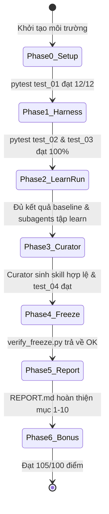

# AGENT_FLOW: Master Execution Runbook for Autonomous & Multi-Agent Swarms

> **Dành cho:** AI Coding Agents / Multi-Agent Swarms / Kỹ sư thực hiện bài lab **Self-Evolving Agentic**.  
> **Mục tiêu:** Cung cấp quy trình từng bước (State Machine Flow) với các điều kiện dừng (checkpoints), lệnh kiểm tra tự động và tiêu chuẩn nghiệm thu (Acceptance Criteria) để hoàn thành bài lab đạt 100/100 điểm theo `RUBRIC.md` (+5 điểm thưởng).

---

## 🧭 BẢN ĐỒ TRẠNG THÁI THỰC THI (STATE MACHINE)



---

## ⚠️ CÁC NGUYÊN TẮC BẤT DI BẤT DỊCH (NON-NEGOTIABLE CONSTRAINTS)

Mọi Agent khi thực thi repo này **BẮT BUỘC** tuân thủ:

1. **Bảo mật tuyệt đối**: Tuyệt đối không commit file `.env`, không in API key vào `trace.md`, `run.json` hay báo cáo (`-10 điểm` nếu vi phạm).
2. **Nguyên vẹn mã nguồn kiểm thử**: Tuyệt đối không sửa bất kỳ file nào trong `tests/`, `tasks/`, `scripts/`, hay các file engine có sẵn (`model.py`, `grading.py`, `tasks.py`, `compare.py`, `testing.py`) (`-10 điểm` nếu vi phạm).
3. **Quy tắc đường dẫn tương đối**: Agent làm việc với sandbox luôn dùng đường dẫn tương đối `workspace/...` và `skills/...` (không bắt đầu bằng dấu `/`).
4. **Không sửa tay Skill**: Toàn bộ nội dung trong `skills/auto/` phải do `python -m lab.curator` tự động sinh ra. Nghiêm cấm sửa tay nội dung file `SKILL.md` (`-10 điểm` nếu vi phạm).
5. **Quy trình đóng băng (Freeze Protocol)**: Giả thuyết (H1-H3) phải được commit trước khi tạo git tag `freeze`. `python scripts/verify_freeze.py` phải trả về `OK`.

---

## 📌 PHASE 0: CÀI ĐẶT MÔI TRƯỜNG & KHẢO SÁT BAN ĐẦU

### Mục tiêu
Chuẩn bị runtime sạch, kiểm tra kết nối LLM, chạy tour và trả lời Mục 3 của `report/REPORT.md`.

### Các bước thực hiện

1. **Khởi tạo môi trường:**
   ```bash
   # Nếu trên Windows, nên chạy trong môi trường WSL hoặc Docker (do LocalShellBackend dùng shell Linux)
   python -m venv .venv
   # Linux/WSL:
   source .venv/bin/activate
   # Windows PowerShell:
   # .venv\Scripts\Activate.ps1

   pip install -e .
   # Nếu dùng Gemini qua google_genai, cài thêm:
   pip install langchain-google-genai
   ```

2. **Khởi tạo báo cáo nếu chưa có:**
   ```bash
   cp REPORT_TEMPLATE.md report/REPORT.md
   ```

3. **Kiểm tra bộ test có sẵn (Offline, 0 token):**
   ```bash
   pytest tests/test_01_provided.py
   ```
   - **Checkpoint 0.1**: Phải đạt `12 passed`.

4. **Kiểm tra kết nối Model (1 token):**
   ```bash
   python -c "from lab.model import make_model; print(make_model().invoke('Reply with OK').content)"
   ```
   - **Checkpoint 0.2**: Trả về `OK` hoặc phản hồi tương tự, không lỗi API key hay 401/404.

5. **Chạy Tour Deep Agents:**
   ```bash
   python scripts/tour.py
   ```
   - **Nhiệm vụ Agent**: Đọc kết quả in ra và điền ngay câu trả lời vào **Mục 3** của `report/REPORT.md`:
     - *Câu 1*: Liệt kê các công cụ mặc định (`ls`, `read_file`, `write_file`, `edit_file`, `delete`, `glob`, `grep`, `execute`, `task`). Công cụ chạy lệnh: `execute`.
     - *Câu 2*: Subagent `general-purpose` được cô lập ngữ cảnh (context isolation), chỉ nhìn thấy nội dung message được giao việc bởi agent chính qua công cụ `task`.
     - *Câu 3*: Trích dẫn 1 câu hướng dẫn hành vi từ mô tả công cụ `task` và 1 câu từ `execute`.

---

## 📌 PHASE 1: HOÀN THIỆN AGENT HARNESS (CORE MODULES)

### Mục tiêu
Cài đặt 3 file mã nguồn theo đúng đặc tả pseudocode. Bộ test `test_02` và `test_03` đạt 100%.

### Chi tiết cài đặt

#### 1. File `src/lab/subagents.py`
- **File hướng dẫn**: `guides/pseudocode/02_subagents.md`
- **Yêu cầu**: Cài đặt `get_subagents() -> list[dict]` trả về ít nhất 2 subagents (khuyến nghị 3 subagents) với cấu trúc:
  ```python
  def get_subagents() -> list[dict]:
      return [
          {
              "name": "explorer",
              "description": "Use when you need to inspect project structure, read documentation, search codebase, or inspect raw logs/data without modifying files.",
              "system_prompt": "You are a code and data exploration specialist. Read and analyze files thoroughly. Report precise facts, schema details, and root causes without making any file modifications.",
          },
          {
              "name": "implementer",
              "description": "Use when you need to write or edit source code, fix identified bugs, clean dirty datasets, or execute scripts in the sandbox workspace.",
              "system_prompt": "You are an implementation specialist. Execute required changes carefully in workspace/ and run local tests to verify your implementation before reporting back.",
          },
          {
              "name": "reviewer",
              "description": "Use when work has been implemented and you need an independent verification of task constraints, output format, edge-cases, and regression tests.",
              "system_prompt": "You are a quality assurance reviewer. Verify that all task requirements and constraints are satisfied. Do not edit files; only report findings and validation status.",
          },
      ]
  ```
- **Kiểm tra:**
  ```bash
  pytest tests/test_02_agent.py -k subagents
  ```

#### 2. File `src/lab/agent.py`
- **File hướng dẫn**: `guides/pseudocode/01_agent.md`
- **Yêu cầu 1: `make_backend(sandbox: Path)`**:
  - `root_dir = sandbox`, `virtual_mode = True`, `inherit_env = False`, `timeout = 120`.
  - Biến môi trường `env`:
    ```python
    env = {
        "PATH": str(Path(sys.executable).parent) + ":/usr/local/bin:/usr/bin:/bin",
        "HOME": str(sandbox),
        "PYTHONDONTWRITEBYTECODE": "1",
    }
    ```
- **Yêu cầu 2: `build_agent(sandbox, mode="single", use_skills=False, model=None)`**:
  - Validate `mode in {"single", "subagents"}`.
  - Khi `mode == "subagents"`: Nối `PATHS_NOTE` vào `system_prompt` của từng subagent lấy từ `get_subagents()`. Nối `SUBAGENTS_NOTE` vào prompt chính.
  - Khi `use_skills == True`: Thêm `skills=["/skills/"]` vào kwargs, nối `SKILLS_NOTE` vào prompt chính.
  - Trả về `create_deep_agent(...)`.
- **Kiểm tra:**
  ```bash
  pytest tests/test_02_agent.py
  ```
  - **Checkpoint 1.1**: Phải đạt `9 passed`.

#### 3. File `src/lab/runner.py`
- **File hướng dẫn**: `guides/pseudocode/03_runner.md`
- **Yêu cầu: `run_task(...)`**:
  - Tạo sandbox tạm: `sandbox = Path(tempfile.mkdtemp(prefix="lab_sandbox_"))`.
  - Sao chép dữ liệu: `prepare_sandbox(task, sandbox, skills_dir)`.
  - Lưu hash ban đầu: `hash_truoc = hash_dir(sandbox / "skills")`.
  - Thu thập token: dùng `UsageMetadataCallbackHandler` từ `langchain_core.callbacks`.
  - Đếm chỉ số trên luồng chính (`result["messages"]`):
    - `tool_calls`: Tổng số tool calls trong tất cả `AIMessage`.
    - `subagent_calls`: Số tool call có `name == "task"`.
    - `skills_read`: Số tên thư mục con khác nhau ngay sau `skills/` được gọi bởi tool `read_file`.
    - `skills_modified`: `hash_dir(sandbox / "skills") != hash_truoc`.
  - Xử lý lỗi an toàn: Bắt `Exception` ghi vào `record["error"]`, không làm sập chương trình.
  - Chấm điểm qua `grade(task, sandbox / "workspace")`.
  - Dọn dẹp sandbox trong `finally: shutil.rmtree(sandbox, ignore_errors=True)`.
  - Lưu kết quả vào `results/<condition>/<task_id>/run.json` và `trace.md`.
- **Kiểm tra:**
  ```bash
  pytest tests/test_03_runner.py
  ```
  - **Checkpoint 1.2**: Phải đạt `6 passed`.

#### 4. Chạy Dry Run tác vụ đầu tiên
```bash
python -m lab.runner --condition baseline --tasks data-learn
```
- **Checkpoint 1.3**: Tác vụ chạy thành công, sinh `results/baseline/data-learn/run.json` và `trace.md`. Token `total > 0`, không crash.

---

## 📌 PHASE 2: ĐO LƯỜNG TẬP HỌC & PHÂN LOẠI LỖI (ERROR TAXONOMY)

### Mục tiêu
Thu thập toàn bộ dữ liệu của tập học (`learn`) cho 2 điều kiện `baseline` và `subagents`. Phân loại lỗi khoa học vào Mục 4 & Mục 5 của báo cáo.

### Các bước thực hiện

1. **Chạy các tác vụ học còn lại:**
   ```bash
   # data-learn đã chạy ở Phase 1
   python -m lab.runner --condition baseline --tasks code-learn logs-learn
   python -m lab.runner --condition subagents --tasks learn
   ```
   - **Checkpoint 2.1**: Đủ 3 folder trong `results/baseline/` và 3 folder trong `results/subagents/`.

2. **Lập bảng phân loại lỗi (Mục 4 `report/REPORT.md`):**
   - Mở các file `run.json` của 3 task học `baseline`. Tìm các check có `passed == False`.
   - Phân loại theo 7 nhóm chuẩn:
     - **A**: Bỏ qua đặc tả (không đọc readme/docstrings).
     - **B**: Không kiểm chứng (không chạy lại test kiểm tra).
     - **C**: Vá triệu chứng (sửa vị trí báo lỗi thay vì nguyên nhân gốc).
     - **D**: Bỏ sót dữ liệu bẩn / sai định dạng ngày tháng, múi giờ.
     - **E**: Vi phạm quy ước tổ chức (check tên `rule_...`, detail bắt đầu bằng `RULE:`).
     - **F**: Báo cáo hoàn thành sai sự thật.
     - **G**: Khác.
   - Điền chi tiết: Tên task, tên check, nhóm lỗi, trích dẫn ngắn từ trường `detail` hoặc vết `trace.md`.
   - Nếu đa số lỗi thuộc nhóm E: Chạy `python scripts/check_breakdown.py` và lấy tỉ lệ check kỹ thuật đạt/tổng làm bằng chứng phủ định cho các nhóm A-D.

3. **Phân tích hành vi Subagents (Mục 5 `report/REPORT.md`):**
   - Ghi lại số lần gọi `subagent_calls` của từng task.
   - Đọc `trace.md`: Agent chính có giao việc không? Lời giao việc có chứa đủ đường dẫn và quy tắc không? Báo cáo của subagent có được agent chính kiểm tra lại trước khi dùng không?
   - Ghi chú: Nếu `subagent_calls == 0`, giải thích rõ lý do vì sao LLM chọn tự giải quyết.
   - So sánh lượng token tiêu thụ giữa `subagents` và `baseline`.

---

## 📌 PHASE 3: SELF-EVOLVING LAYER (CURATOR & AUTO-SKILLS)

### Mục tiêu
Cài đặt Curator tự động đọc vết lỗi từ tập học để viết Skill. Kiểm thử và chạy thử nghiệm điều kiện `skills-auto` trên tập học.

### Các bước thực hiện

1. **Cài đặt `src/lab/curator.py`:**
   - **File hướng dẫn**: `guides/pseudocode/04_curator.md`
   - **Yêu cầu: `curate_skills(...)`**:
     - Đọc các run từ `results/<source_condition>/*/run.json` với điều kiện nghiêm ngặt: **CHỈ LẤY** `r["role"] == "learn"` (tuyệt đối không đọc task eval).
     - Trích xuất danh sách check thất bại (`name`, `detail`) và 6000 ký tự cuối của `trace.md`.
     - Nếu không có check thất bại nào: in thông báo và trả về `[]` (không gọi LLM).
     - Tạo prompt chuẩn yêu cầu LLM viết tối đa `max_skills` kỹ năng dạng checklist.
     - Parse các khối kỹ năng qua `parse_skill_blocks(reply)`.
     - Validate từng skill qua `validate_skill(text, expected_name=name)`. Bỏ qua các skill vi phạm.
     - Ghi skill hợp lệ vào `<out_dir>/<name>/SKILL.md`.
- **Kiểm tra:**
  ```bash
  pytest tests/test_04_curator.py
  ```
  - **Checkpoint 3.1**: Phải đạt `2 passed`.

2. **Chạy Curator để sinh Skill:**
   ```bash
   python -m lab.curator
   ```
   - **Checkpoint 3.2**: Sinh ra ít nhất 1-2 skill hợp lệ trong `skills/auto/`.

3. **Đánh giá chất lượng Skill (Mục 6 `report/REPORT.md`):**
   - Đọc từng file `skills/auto/<tên-skill>/SKILL.md` theo hướng dẫn `guides/pseudocode/05_skill_quality.md`.
   - Đánh giá 3 tiêu chí:
     1. *Tính tổng quát*: Có bị dính tên file, tên cột cụ thể của task learn không?
     2. *Tính đúng đắn*: Có hướng dẫn nào sai hoặc gây hại không?
     3. *Độ dài & Description*: Description có nêu rõ tình huống kích hoạt ("Use when...") không?
   - *Lưu ý*: Không được sửa tay file. Nếu skill kém, được phép xóa folder skill đó và chạy lại `python -m lab.curator` (tối đa 2 lần). Ghi rõ lý do vào báo cáo.

4. **Chạy thử nghiệm `skills-auto` trên tập Học:**
   ```bash
   python -m lab.runner --condition skills-auto --tasks learn
   ```
   - Kiểm tra `run.json`: Xem `skills_read` có lớn hơn 0 không.
   - **Sao lưu ngay kết quả để làm căn cứ đo nhiễu (BẮT BUỘC):**
     ```bash
     cp -r results/skills-auto results/skills-auto-dev
     ```

---

## 📌 PHASE 4: GIẢ THUYẾT, ĐÓNG BĂNG & CHẠY TẬP ĐÁNH GIÁ (FREEZE PROTOCOL)

### Mục tiêu
Tuân thủ quy trình kiểm thử khoa học: Giả thuyết cam kết trước khi đóng băng tri thức; kiểm tra hợp lệ bằng `verify_freeze.py`.

### Các bước thực hiện

1. **Điền Mục 2 (Giả thuyết) vào `report/REPORT.md`:**
   - **H1 (subagents so với baseline)**: Dự đoán điểm số và token trên tập eval (ví dụ: subagents có thể tăng tính kiểm chứng nhưng tốn token gấp 1.5 - 2 lần, hiệu quả phụ thuộc vào việc agent có chủ động delegate không).
   - **H2 (skills-auto so với baseline)**: Dự đoán kỹ năng tự sinh giúp khắc phục các lỗi quy ước tổ chức (nhóm E) và tăng điểm trên eval, nhưng ít tác dụng đối với các quy ước hoàn toàn mới chưa gặp ở learn.
   - **H3 (tập học so với tập đánh giá)**: Dự đoán điểm số trên eval sẽ thấp hơn hoặc bằng learn do distribution shift và các test edge-case mới.

2. **Commit Giả thuyết:**
   ```bash
   git add report/REPORT.md
   git commit -m "hypotheses"
   ```
   - **Checkpoint 4.1**: Git log có commit `hypotheses`.

3. **Đóng băng Skill và Tạo Git Tag `freeze`:**
   ```bash
   git add -A
   git commit --allow-empty -m "freeze skills"
   git tag freeze
   ```
   - **Checkpoint 4.2**: Tag `freeze` được tạo thành công ngay sau commit `hypotheses`.

4. **Chạy chính thức toàn bộ thí nghiệm:**
   ```bash
   # Chạy eval cho baseline và subagents:
   python -m lab.runner --condition baseline --tasks eval
   python -m lab.runner --condition subagents --tasks eval

   # Chạy lại toàn bộ 6 tasks cho skills-auto với bộ skill đã đóng băng:
   python -m lab.runner --condition skills-auto --tasks all
   ```
   - **Checkpoint 4.3**: Thư mục `results/` có đủ 6 tác vụ cho cả 3 điều kiện (`baseline`, `subagents`, `skills-auto`).

5. **Xác thực quy trình đóng băng:**
   ```bash
   python scripts/verify_freeze.py
   ```
   - **Checkpoint 4.4 (BẮT BUỘC)**: Kết quả in ra phải là `OK`. Không được có bất kỳ cảnh báo đỏ nào.

---

## 📌 PHASE 5: TỔNG HỢP KẾT QUẢ & HOÀN THIỆN BÁO CÁO

### Mục tiêu
Sinh bảng số liệu chuẩn, trích xuất dữ liệu phân tích và hoàn thiện tất cả các mục từ 1 đến 10 trong `report/REPORT.md`.

### Các bước thực hiện

1. **Tạo bảng tổng hợp so sánh:**
   ```bash
   python -m lab.compare > report/table.md
   ```
   - Dán nội dung của `report/table.md` vào **Mục 7** của `report/REPORT.md`.

2. **Chạy thống kê chi tiết:**
   ```bash
   python scripts/check_breakdown.py
   ```
   - Dán kết quả phân tích số check kỹ thuật vs quy ước vào Mục 7.

3. **Hoàn thiện Mục 8 (Phân tích khoa học):**
   - **Câu 1**: So sánh điểm số giữa các điều kiện trên tập learn vs eval. Nhận diện quá khớp (overfitting).
   - **Câu 2**: Phân tích xem skill giúp đạt nhóm check nào (kỹ thuật hay quy ước). Check quy ước mới của eval có đạt không và tại sao.
   - **Câu 3**: Dẫn chứng 1 check thành công nhờ skill và 1 check không thành công từ vết `trace.md`.
   - **Câu 4**: Phân tích kinh tế học token (Token Economics) - Điểm số đạt được trên mỗi 1000 tokens. Đánh giá tính kinh tế của Multi-Agent.
   - **Câu 5**: Phân tích về rò rỉ dữ liệu (Data Leakage) và cách Curator đảm bảo tính tổng quát.
   - **Câu 6**: Đo lường độ nhiễu: So sánh điểm của `skills-auto` trên tập learn ở Phase 3.4 (trong `results/skills-auto-dev`) và Phase 4.2 sau đóng băng.

4. **Hoàn thiện các mục còn lại:**
   - **Mục 1**: Điền thông tin nhóm, model (`LAB_MODEL`), nhiệt độ, commit hash của tag `freeze`.
   - **Mục 9**: Nêu ít nhất 3 hạn chế thực nghiệm (kích thước tập test nhỏ, chạy 1 lần, phương sai LLM, bias của quy ước Acme).
   - **Mục 10**: Kết luận ngắn gọn (tối đa 5 câu) bám sát số liệu thực tế.

---

## 📌 PHASE 6: THỬ THÁCH MỞ RỘNG (+5 ĐIỂM THƯỞNG - OPTIONAL)

### Hướng thực hiện tối ưu: 6d (Subagent có Skill) hoặc 6b (Vòng tiến hóa 2)

**Lựa chọn khuyến nghị: Hướng 6d (Subagent trang bị Skill)**
1. Mở rộng `get_subagents()` trong `src/lab/subagents.py` bằng cách thêm thuộc tính:
   ```python
   "skills": ["/skills/"]
   ```
2. Chạy thử nghiệm trên tập eval và lưu vào thư mục riêng:
   ```bash
   python -m lab.runner --condition subagents --tasks eval --results results/subagents-skills
   ```
3. So sánh với kết quả `results/subagents/`: Đánh giá xem subagent khi có tri thức thủ tục (procedural knowledge) có tự chủ hơn và thực hiện chính xác hơn không.
4. Trình bày phương pháp và bảng số liệu so sánh vào phần **Phụ lục** của báo cáo.

---

## 🛠️ BẢNG XỬ LÝ SỰ CỐ NHANH CHO AGENT (TROUBLESHOOTING MATRIX)

| Vấn đề gặp phải | Nguyên nhân gốc rễ | Hành động khắc phục |
|---|---|---|
| `command not found: python` trong vết shell | `make_backend` thiếu đường dẫn python trong `PATH` | Đặt `PATH = str(Path(sys.executable).parent) + ":/usr/local/bin:/usr/bin:/bin"` |
| `No such file or directory: /workspace/...` | Dùng đường dẫn tuyệt đối bắt đầu bằng `/` | Đổi sang đường dẫn tương đối `workspace/...` |
| `verify_freeze.py` báo FAILED | Tag freeze bị tạo trước commit hypotheses hoặc skill bị sửa sau freeze | Xóa tag cũ `git tag -d freeze`, commit hypotheses, tag lại `git tag freeze` và chạy lại các run |
| `skills_read == 0` trong kết quả | `description` của skill chưa đủ rõ ràng hoặc prompt chưa kích hoạt | Đánh giá lại description trong `SKILL.md`, chạy lại curator nếu cần |
| Tác tử chạy lặp vô tận / tốn quá nhiều token | Vượt quá recursion limit | Runner đã cấu hình `--recursion-limit 60`, lỗi được tự động bắt vào `record["error"]` |
